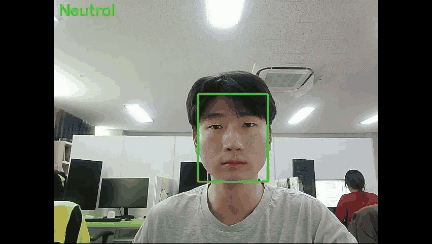

# Chain-of-Affect_Compound-FER
This is the repository for the Chain of Affect model, a VLM-based pipeline for compound FER

## 📑 Table of Contents
- [About the Project](#-🧠-about-the-project)
- [Installation](#⚙️-installation)
- [Dataset Preparation](#dataset-preparation)
- [Finetuning](#finetuning)
- [Inference](#inference)
- [Webcam Demo (Proof of Concept)](#webcam-demo-proof-of-concept)
- [Pretrained Model (Hugging Face)](#pretrained-model-hugging-face)
- [References and Acknowledgements](#references-and-acknowledgements)
- [License](#license)
- [Citation](#citation)

---

## 🧠 About the Project

<!--
This repository accompanies the paper:

> **Chain-of-Affect: Compound Facial Expression Recognition through Sequential Vision Language Model Prompting for Interactive Robots**  
> (Submitted to EAAI 202X)
-->

This repository contains:
- Code to **finetune** [Phi-3.5 Vision](https://huggingface.co/microsoft/Phi-3.5-vision-instruct) on the RAF-DB training set using the proposed Chain-of-Affect prompting method.
- Scripts for **inference** on the RAF-DB test set for both basic and compound facial expression recognition (FER).
- A **webcam demo** script to test real-time compound FER.

---

## ⚙️ Installation

Set up the environment using `environment.yaml`:

```bash
conda env create -f environment.yaml
conda activate phi3v
```

---

## 📂 Dataset Preparation

We use the RAF-DB dataset for both training and evaluation.
1. Visit the RAF-DB dataset page and request access:
http://www.whdeng.cn/RAF/model1.html
2. Download the "aligned" images in both basic and compound emotion
3. Save all train image samples of both basic and compound emotion under ```RAF-DB/all/train``` and save all test image samples of both basic and compound emotion under ```RAF-DB/all/valid```

_Citation: Li, Shan, et al. "Reliable crowdsourcing and deep locality-preserving learning for expression recognition in the wild." CVPR 2017._

---

## 🏋️ Finetuning

To finetune the model with LoRA using Chain-of-Affect prompting on the RAF-DB train set, run the following command:

```bash
bash scripts/finetune_lora_vision_all_ft_only.sh
```

Adjust the options in ```finetune_lora_vision_all_ft_only.sh``` according to your intended settings.

---

## 🧪 Inference

To test the model on the RAF-DB test set with either basic or compound FER, follow these steps:
### 1. Download the pretrained weights from Hugging Face:

#### 🐧 For Linux/macOS users:

Use the following commands to download the weights into the correct directory:

```bash
mkdir -p output/lora_vision_all_ft_only

wget https://huggingface.co/joeshin3956/Chain-of-Affect/resolve/main/adapter_model.safetensors -O output/lora_vision_all_ft_only/adapter_model.safetensors

wget https://huggingface.co/joeshin3956/Chain-of-Affect/resolve/main/non_lora_state_dict.bin -O output/lora_vision_all_ft_only/non_lora_state_dict.bin
```

#### 🪟 For Windows users:

Visit the Hugging Face model page for the Chain-of-Affect pretrained model and manually download the following files:
- [adapter_model.safetensors](https://huggingface.co/joeshin3956/Chain-of-Affect/resolve/main/adapter_model.safetensors)
- [non_lora_state_dict.bin](https://huggingface.co/joeshin3956/Chain-of-Affect/resolve/main/non_lora_state_dict.bin)

and save them under the path: ```output/lora_vision_all_ft_only```

Note: Only the large files (```adapter_model.safetensors```, ```non_lora_state_dict.bin```) are hosted on huggingface. All config files are included in this repo under ```output/lora_vision_all_ft_only/```

### 2. Run the Inference Script

Once the model files are in place, run the inference code by opening and executing ```finetune_lora_vision_all_ft_only.ipynb```

This notebook contains code for:
- Loading the pretrained model and LoRA adapter
- Running inference on the RAF-DB test set for basic and compound FER (separately)
- Calculating the UAR for both tests

---

## 🎥 Webcam Demo (Proof of Concept)



> ⚠️ This is an early proof-of-concept and not yet a flawless real-time demo.
>
> It may have performance bottlenecks and bugs.

This webcam demo accesses the webcam connected to the system and makes predictions about the current facial expression using the webcam footage.

We use the [YOLOv8n-face model](https://github.com/akanametov/yolo-face) for cropping the facial region to use as input for the model.

To run the program:
1. [Download the pretrained weights from Hugging Face](#1-download-the-pretrained-weights-from-hugging-face), if you haven't already.
2. Save the pretrained weights in the path: ```webcam_demo/lora_vision_all_ft_only```
3. Run the python file with:
  ```bash
  python webcam_demo.py
  ```

---

## 📄 License
This project is licensed under the Apache 2.0 License. See the [LICENSE](LICENSE) file for details.
<!--
---

## 📚 Citation
If you use this work in your research, please consider citing:
```bibtex
@misc{chainofaffect202X,
  title={Chain-of-Affect: Compound Facial Expression Recognition through Sequential Vision Language Model Prompting for Interactive Robots},
  author={Your Name},
  year={202X},
  note={Submitted to EAAI},
  url={https://github.com/Joe-Shin/Chain-of-Affect_Compound-FER}
}
```
-->
---

## 🙏 References and Acknowledgements
This project is based on
- 📄 Phi-3 Technical Report: [_Phi-3 Technical Report: A Highly Capable Language Model Locally on Your Phone_](https://arxiv.org/abs/2404.14219)
- 🤗 Base Model: [```microsoft/Phi-3.5-vision-instruct```](https://huggingface.co/microsoft/Phi-3.5-vision-instruct)
- 🔬 Dataset: [RAF-DB](http://www.whdeng.cn/RAF/model1.html)
- 🔍 Face Region Cropping Model Used: [YOLOv8n-face](https://github.com/akanametov/yolo-face)
- 🛠️ Finetuning Codebase Based On: [Phi3-Vision-Finetune GitHub Repository](https://github.com/2U1/Phi3-Vision-Finetune/tree/main)
